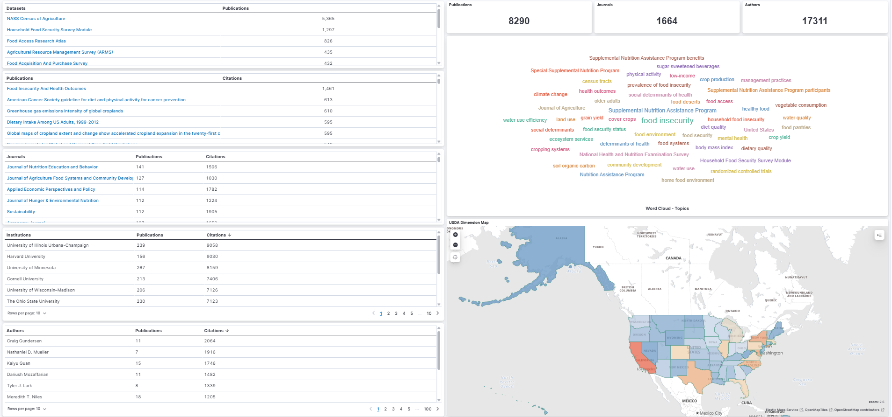
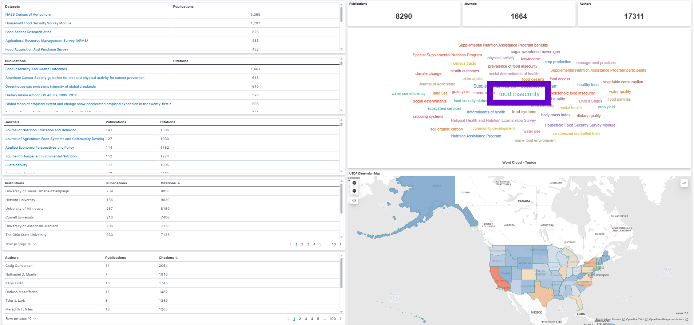
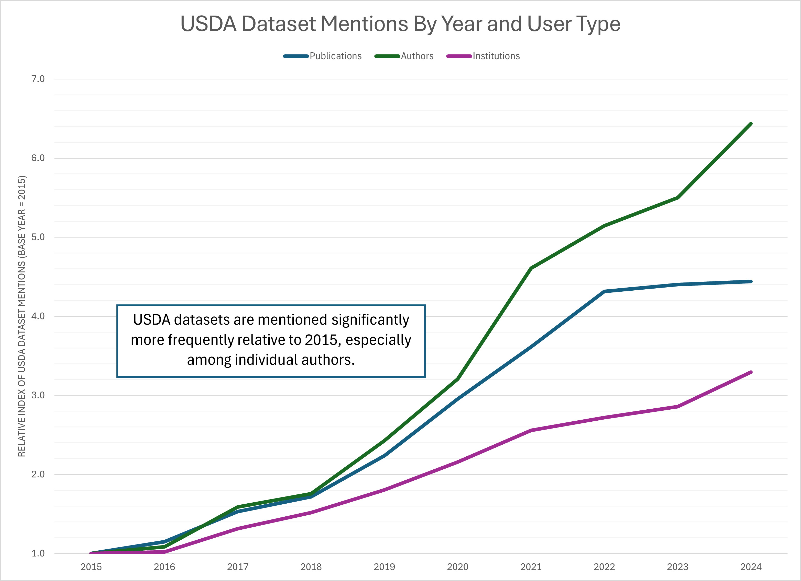
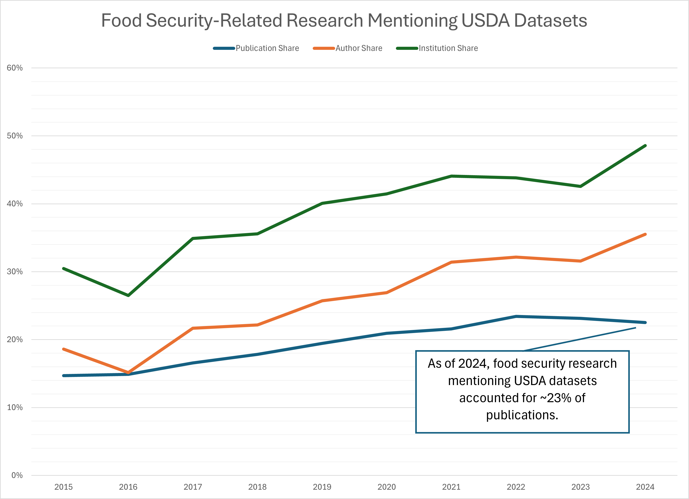
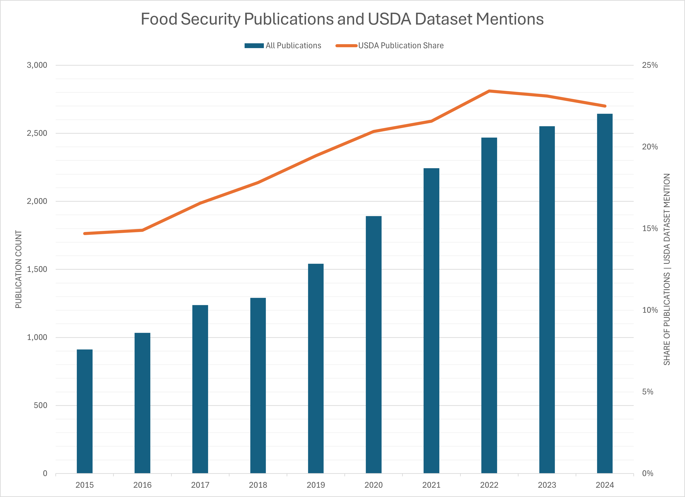

## Setting

Over the past several months, I've been working on a project that looks at  how USDA datasets are mentioned in research publications.
  
  

In the following slides, I'd like to share some of these initial findings and ask:
  

**What would be useful for AAEA section members?**
 
 

::: {.callout-note icon=false title="Possible questions to reflect on as you're listening"}
- Are there emerging research topics that could inform next year’s track session proposals?
- Could this type of platform help identify potential collaborators or build working groups?
- What can metadata on funding and topic trends tell us about who is supporting research in your section’s area of focus?
:::

## Why USDA data?

USDA ERS and NASS were interested in tracking how their datasets are referenced in research papers.

Two dashboards that track <em>mentions</em>* of **11 key datasets** in articles were built.

This helps:

- Summarize dataset usage over time
- Identify where and in what topics USDA data shows up
- Highlight research across areas like food security, crop production, and others...

These 11 datasets were selected based on relevance and input from USDA staff and researchers.

 
<small>*A dataset mention refers to an instance in which a specific dataset is referenced, cited, or named within a research publication. This can occur in various parts of the text, such as the abstract, methods, data section, footnotes, or references, and typically indicates that the dataset was used, analyzed, or discussed in the study.</small>

::: footer
Read more about this project [here](https://laurenchenarides.github.io/compare_scopus_openalex_report/report.html).
:::

## Who uses USDA data...

We searched a large publication corpus (Dimensions) to find mentions of <b>11 USDA datasets</b> and found that <b>17,311 authors</b> mentioned these datasets across <b>8,290 publications</b> in <b>1,664 journals</b>.

  

:::{.callout-note title="Details about this exercise"}

Searched articles published between 2015-2025.

Data source: Dimensions via Google BigQuery

Datasets searched:

1. Agricultural Resource Management Survey (ARMS)
2. Current Population Survey Food Security Supplement
3. Farm to School Census
4. Information Resources, Inc. (IRI) InfoScan (through USDA TPAA)
5. NASS Census of Agriculture
6. Tenure, ownership, and transition of agricultural land (TOTAL) survey
7. Food Access Research Atlas
8. Food Acquisition and Purchase Survey
9. Household Food Security Survey Module
10. Local Food Marketing Practices Survey
11. Quarterly Food at Home Price Database

Mentions of datasets can be found in publications by applying ML models and other methods.

References:

- [Harvard Data Science Review. (2024). *Democratizing Data: Discovering Data Use and Value for Research and Policy*. Special Issue 4.](https://hdsr.mitpress.mit.edu/specialissue4)

- [Hausen, Ryan, and Hosein Azarbonyad. (2024). "Discovering data sets through machine learning: An ensemble approach to uncovering the prevalence of government-funded data sets." *Harvard Data Science Review*, Special Issue 4.]( https://hdsr.mitpress.mit.edu/pub/ou89oggk/release/7?readingCollection=a6db7dff)

- [Chenarides, L., Bryan, C., & Ladislau, R. (2025). *Methodology for comparing citation database coverage of dataset usage.*](https://laurenchenarides.github.io/compare_scopus_openalex_report/report.html)
:::

::: footer
Work was funded by the US Department of Agricultural (Economic Research Service and National Agricultural Statistics Service), the National Center for Science and Engineering Statistics, and the National Center for Education Statistics.
:::

::: {.notes}
Many of us depend on publicly available data to answer food and agricultural research questions.
:::

## ...and how?

**Food insecurity** is one of the most frequently occurring topics among publications mentioning selected USDA datasets across all journals.

<small>*The word cloud shows the frequency of associated topics — larger words indicate more publications on that topic.* </small>

::: footer
Access the Democratizing Data FAR Data Dashboard [here](https://democratizingdata.ai/tools/dashboard/dimensions/food-agricultural-research/#dashboard-container). 
:::

## Use case: What can we observe from a focused topic area?

To better understand how USDA datasets are used, we examined one area in more detail: <b>food security–related research</b>.*

This example will show:

1. The extent to which selected USDA datasets are mentioned within a topic area

2. The share of food security research that explicitly mentions these datasets 

3. How dataset usage has changed over time relative to all published work in this area

 
<small>*Food security-related research includes articles with topics such as: “food security,” “SNAP,” “WIC,” “food access,” “food availability,” “food insecurity prevalence,” and “Nutrition Assistance Program.”</small>

## USDA dataset mentions have increased significantly among food security-related research over time.

  

**Takeaways:**

- Authors have grown more than 6x, suggesting strong interest across the research community
- Publications have grown, but pace has leveled off slightly in recent years
- Institutional growth is slower, perhaps due to potential concentration within organizations

:::{.callout-note title="Details about this figure"}
This figure plots an index of unique publications, authors, or institutions mentioning the selected USDA datasets from 2015-2024, where 2015 is the base year (index = 1). For example, there were 595 publications in 2024 and 134 in 2015, so the index is 595 / 134 = 4.44.

Terms used to define food security research include: “food security”, “food insecurity”, “food security status”, “Supplemental Nutrition Assistance Program (SNAP)”, “Special Supplemental Nutrition Program for Women, Infants, and Children (WIC)”, “food access”, “food availability”, “prevalence of food insecurity”, “food pantries”, and “Nutrition Assistance Program”.

Data source: Dimensions via Google BigQuery
:::

::: {.notes}
Establish that USDA datasets are integral to food security-related research.
:::

## Publications mentioning selected USDA datasets only account for 21% of all food security-related publications.

  

<small>*Food security–related research accounts for ~19% of all published work in this sample (2015–2025).*</small>

:::{.callout-note title="Details about this figure"}
This figure compares:

- Denominator: All publications in the Dimensions database (via Google BigQuery) that mention food security–related terms, published between 2015 and 2024, excluding preprints and conditional on at least one US-affiliated author and falling within the fields of research "3801 Applied economics" or "30 AGRICULTURAL, VETERINARY AND FOOD SCIENCES".
- Numerator: The subset of those publications that also mention one or more of the 11 USDA datasets.

Terms used to define food security research include: “food security”, “food insecurity”, “food security status”, “Supplemental Nutrition Assistance Program (SNAP)”, “Special Supplemental Nutrition Program for Women, Infants, and Children (WIC)”, “food access”, “food availability”, “prevalence of food insecurity”, “food pantries”, and “Nutrition Assistance Program”.

Data source: Dimensions via Google BigQuery
:::

::: {.notes}
We wanted to determine what proportion of *all* food security-related research mentions these datasets.
:::

## Mentions of selected USDA datasets are leveling off as food security-related research continues to grow. 

  

:::{.callout-note title="Details about this figure"}
This figure shows two trends in food security–related research from 2015 to 2024:

- Bars (left axis): Total number of food security–related publications per year across the Dimensions corpus. These publications have been filtered to include only those with at least one author affiliated with an American institution and falling within the fields of research "3801 Applied economics" or "30 AGRICULTURAL, VETERINARY AND FOOD SCIENCES".
- Line (right axis): Share of those publications that mention one or more USDA datasets.

Terms used to define food security research include: “food security”, “food insecurity”, “food security status”, “Supplemental Nutrition Assistance Program (SNAP)”, “Special Supplemental Nutrition Program for Women, Infants, and Children (WIC)”, “food access”, “food availability”, “prevalence of food insecurity”, “food pantries”, and “Nutrition Assistance Program”.

Data source: Dimensions via Google BigQuery
:::

## What these trends tell us

These USDA datasets are important, accounting for ~21%, on average, of food security-related publications from 2015-2024.

But, ~79% of food security-related research relies on *other* data sources (or doesn't name the data at all).

Next question: **What other datasets are researchers using for food security-related research?**

$\rightarrow$ Currently working on answering this. Requires LLMs trained on full-text data.

::: {.notes}
**Importance:** Additional analysis that helps clarify patterns in data use can inform the tradeoffs between using trusted datasets (e.g., selected USDA datasets) and novel or emerging data sources (yet to be validated by the community)
:::

## Reflecting on value to AAEA Sections

:::{.callout-note icon=false title="Questions to consider"}
- Are there emerging research topics that could inform next year’s track session proposals?
- Could this type of platform help identify potential collaborators or build working groups?
- What can metadata on funding and topic trends tell us about who is supporting research in your section’s area of focus?
:::

**What I've learned:** 

- We can only track what we can see. If authors are not writing about the datasets they use we won't see it. Most authors don't cite their data.

- As an author, I find myself wanting better tools to find comparable studies using the same dataset -- being able to search *within* publications that share a dataset is useful.

- Publication metadata contains rich, underused information (e.g., open access, funders, citations, article processing charges) -- available from [OpenAlexAPI](https://docs.openalex.org/api-entities/works/work-object) or by partnering with [Digital Science (Dimensions)](https://docs.dimensions.ai/dsl/datasource-publications.html).

## What could be done from here

*At this stage, there's a lot more we <b>could</b> do — but we would need resources and the right partners.*

**For you:** 

- Use dashboard to find collaborators, review data usage, and find trends on topics of interest

- What would FSN be interested in looking at? 
  - E.g., track session proposals, pre/post conference workshop ideas...

- Aside from food security, what other topics may be of interest to understand data visibility?

**For our research community:**

- If we can identify the "other" datasets (via LLMs, for example), we can also identify the researchers using them and potentially build networks of topic experts, reviewers, and collaborators around them.

::: {.callout-note icon=false title="Example: Specialty Crops (S-1088)"}
- Use dashboard metadata to explore funding trends on specialty crop research
- Hatch renewal comment: “Expand members” → dashboard can help!
- Meeting idea: live demo + brainstorming researchable questions
:::

## Thank You

::: {.columns}

::: {.column width="50%"}

💬 Questions?\
 
📩 [Lauren.Chenarides\@colostate.edu](mailto:Lauren.Chenarides@colostate.edu){.email}\
🌐 [democratizingdata.ai](democratizingdata.ai)
:::

::: {.column width="50%"}
Acknowledgements:

- Julia Lane
- Rafael Ladislau
- Nick Pallotta
- Spiro Stefanou
:::

:::

<!-- ::: {.callout-note icon="false" title="Our Vision"} -->
<!-- To build a trusted, transparent, and researcher-informed data infrastructure that supports food and agricultural research. -->

<!-- -   Centered on usability, not just access\ -->
<!-- -   Built with — not just for — the research community\ -->
<!-- -   Designed to help different user communities (researchers, reviewers, and policymakers) make better decisions -->

<!-- A future where food and ag researchers can: -->

<!-- -   Find the right data — quickly\ -->
<!-- -   Understand how it’s been used\ -->
<!-- -   Trust the infrastructure behind it\ -->
<!-- -   Build on each other’s work — not start from scratch — and get attribution\ -->
<!-- ::: -->

::: footer
Back to All [Talks](../presentations.qmd).
:::
