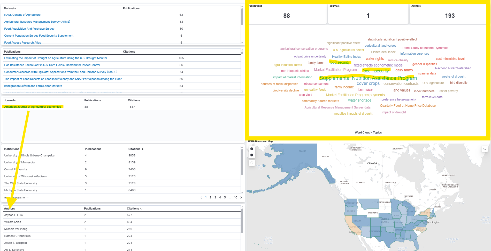
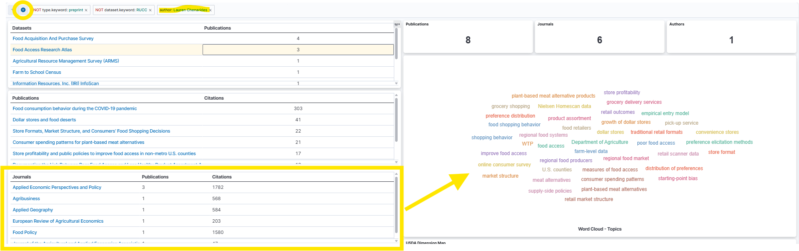

## Setting

Over the past several months, I've been working on a project that looks at  how USDA datasets are mentioned in research publications.
  
  

In the following slides, I'd like to share some of these initial findings and ask:
  

**What would be useful for editors and reviewers?**
 
 

::: {.callout-note icon=false title="Possible questions to reflect on as you're listening"}
- Could better visibility into dataset usage help with reviewer selection?
- Are there opportunities to encourage better practices for dataset mentions/citations in our editorial and review processes?
- How might this work inform benchmarking AJAE against other field journals?
:::

## Why USDA data?

USDA ERS and NASS were interested in tracking how their datasets are referenced in research papers.

Two dashboards that track <em>mentions</em>* of **11 key datasets** in articles were built.

This helps:

- Summarize dataset usage over time
- Identify where and in what topics USDA data shows up
- Highlight research across areas like food security, crop production, and others...

These 11 datasets were selected based on relevance and input from USDA staff and researchers.

 
<small>*A dataset mention refers to an instance in which a specific dataset is referenced, cited, or named within a research publication. This can occur in various parts of the text, such as the abstract, methods, data section, footnotes, or references, and typically indicates that the dataset was used, analyzed, or discussed in the study.</small>

::: footer
Read more about this project [here](https://laurenchenarides.github.io/compare_scopus_openalex_report/report.html).
:::

## Who uses USDA data...

We searched a large publication corpus (Dimensions) to find mentions of <b>11 USDA datasets</b> and found that <b>17,311 authors</b> mentioned these datasets across <b>8,290 publications</b> in <b>1,664 journals</b>.

  

:::{.callout-note title="Details about this exercise"}

Searched articles published between 2015-2025.

Data source: Dimensions via Google BigQuery

Datasets searched:

1. Agricultural Resource Management Survey (ARMS)
2. Current Population Survey Food Security Supplement
3. Farm to School Census
4. Information Resources, Inc. (IRI) InfoScan (through USDA TPAA)
5. NASS Census of Agriculture
6. Tenure, ownership, and transition of agricultural land (TOTAL) survey
7. Food Access Research Atlas
8. Food Acquisition and Purchase Survey
9. Household Food Security Survey Module
10. Local Food Marketing Practices Survey
11. Quarterly Food at Home Price Database

Mentions of datasets can be found in publications by applying ML models and other methods.

References:

- [Harvard Data Science Review. (2024). *Democratizing Data: Discovering Data Use and Value for Research and Policy*. Special Issue 4.](https://hdsr.mitpress.mit.edu/specialissue4)

- [Hausen, Ryan, and Hosein Azarbonyad. (2024). "Discovering data sets through machine learning: An ensemble approach to uncovering the prevalence of government-funded data sets." *Harvard Data Science Review*, Special Issue 4.]( https://hdsr.mitpress.mit.edu/pub/ou89oggk/release/7?readingCollection=a6db7dff)

- [Chenarides, L., Bryan, C., & Ladislau, R. (2025). *Methodology for comparing citation database coverage of dataset usage.*](https://laurenchenarides.github.io/compare_scopus_openalex_report/report.html)
:::

::: footer
Work was funded by the US Department of Agricultural (Economic Research Service and National Agricultural Statistics Service), the National Center for Science and Engineering Statistics, and the National Center for Education Statistics.
:::

::: {.notes}
Many of us depend on publicly available data to answer food and agricultural research questions.
:::

## ...and how?

**Food insecurity** is one of the most frequently occurring topics among publications mentioning selected USDA datasets across all journals.

<small>*The word cloud shows the frequency of associated topics — larger words indicate more publications on that topic.* </small>

::: footer
Access the Democratizing Data FAR Data Dashboard [here](https://democratizingdata.ai/tools/dashboard/dimensions/food-agricultural-research/#dashboard-container). 
:::

## Use case: A new food security submission arrives. Who should review it?

Food security–related articles make up 11% of AJAE publications in this sample. 
The dashboard supports topic filtering to identify active authors and view their broader publishing activity.

::: {.columns}
::: {.column width="50%"}

<small>Filter by topic, publication title, or dataset directly from the dashboard.</small>
:::

::: {.column width="50%"}

<small>Additional customized filtering is available to search by author name, among other key metadata fields.</small>
:::

:::

::: {.notes}
Could better visibility into dataset usage help with reviewer selection?
:::

::: footer
Access the Democratizing Data FAR Data Dashboard [here](https://democratizingdata.ai/tools/dashboard/dimensions/food-agricultural-research/#dashboard-container). 
:::

## Reflecting on value to AJAE

:::{.callout-note icon=false title="Questions to consider"}
- Could better visibility into dataset usage help with reviewer selection?

- Are there opportunities to encourage better practices for dataset mentions/citations in our editorial and review processes?

- How might this work inform benchmarking AJAE against other field journals?
:::

**What I've learned:** 

- We can only track what we can see. If authors are not writing about the datasets they use we won't see it. Most authors don't cite their data.

- Publication metadata contains rich, underused information (e.g., open access, funders, citations, article processing charges) -- available from [OpenAlexAPI](https://docs.openalex.org/api-entities/works/work-object) or by partnering with [Digital Science (Dimensions)](https://docs.dimensions.ai/dsl/datasource-publications.html).

- As an author, I find myself wanting better tools to find comparable studies using the same dataset -- being able to search *within* publications that share a dataset is useful.

## What could be done from here

*At this stage, there's a lot more we <b>could</b> do — but we would need resources and the right partners.*

**At AJAE:** 

- Last year, we discussed online SIs...what about one selecting articles featuring a core dataset as the common thread?

- Beyond food security, what other topics may be of interest to understand data usage?

- Wiley already encourages data citation [(see Wiley's Data Citation Policy)](https://authorservices.wiley.com/author-resources/Journal-Authors/open-access/data-sharing-citation/data-sharing-policy.html) — but is it enforced? What are the metrics on compliance since implementation? Could stronger practices improve transparency? 

## Thank You

::: {.columns}

::: {.column width="50%"}

💬 Questions?\
 
📩 [Lauren.Chenarides\@colostate.edu](mailto:Lauren.Chenarides@colostate.edu){.email}\
🌐 [democratizingdata.ai](democratizingdata.ai)
:::

::: {.column width="50%"}
Acknowledgements:

- Julia Lane
- Rafael Ladislau
- Nick Pallotta
- Spiro Stefanou
:::

:::

<!-- ::: {.callout-note icon="false" title="Our Vision"} -->
<!-- To build a trusted, transparent, and researcher-informed data infrastructure that supports food and agricultural research. -->

<!-- -   Centered on usability, not just access\ -->
<!-- -   Built with — not just for — the research community\ -->
<!-- -   Designed to help different user communities (researchers, reviewers, and policymakers) make better decisions -->

<!-- A future where food and ag researchers can: -->

<!-- -   Find the right data — quickly\ -->
<!-- -   Understand how it’s been used\ -->
<!-- -   Trust the infrastructure behind it\ -->
<!-- -   Build on each other’s work — not start from scratch — and get attribution\ -->
<!-- ::: -->

::: footer
Back to All [Talks](../presentations.qmd).
:::
