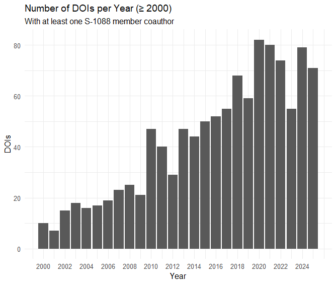

## Setting

*What do you value most from participating in a Multi-State Project (e.g., S-1088)?*

- Networking (highest)
- Data sharing and reuse (low)

*What would members find most useful going forward?*

- Building opportunities for joint collaboration, especially around data collection and use

**Takeaway:**

Members see strong value in connections but want better structures for collaborative data use.

## Tracking usage of USDA datasets

Over the past several months, I've been working on a project that looks at  how USDA datasets are mentioned in research publications.
  
  

In the following slides, I'd like to share some of these initial findings and ask:
  

**What would be useful for S-1088 members?**
 
 

::: {.callout-note icon=false title="Questions to consider"}
- Could this kind of platform help identify potential collaborators or shared research interests?
- What could metadata patterns reveal about activity in your research area?
- What does the funding metadata suggest about who is investing in your field?
:::

## Why USDA data?

USDA ERS and NASS were interested in tracking how their datasets are referenced in research papers.

Two dashboards that track <em>mentions</em>* of **11 key datasets** in articles were built.

This helps:

- Summarize dataset usage over time
- Identify where and in what topics USDA data shows up
- Highlight research across areas like food security, crop production, and others.

These 11 datasets were selected based on relevance and input from USDA staff and researchers.

 
<small>*A dataset mention refers to an instance in which a specific dataset is referenced, cited, or named within a research publication. This can occur in various parts of the text, such as the abstract, methods, data section, footnotes, or references, and typically indicates that the dataset was used, analyzed, or discussed in the study.</small>

## Details about this exercise

Datasets searched:

1. Agricultural Resource Management Survey (ARMS)
2. Current Population Survey Food Security Supplement
3. Household Food Security Survey Module
4. Farm to School Census
5. Information Resources, Inc. (IRI) InfoScan (through USDA TPAA)
6. NASS Census of Agriculture
7. Tenure, ownership, and transition of agricultural land (TOTAL) survey
8. Food Access Research Atlas
9. Food Acquisition and Purchase Survey
10. Local Food Marketing Practices Survey
11. Quarterly Food at Home Price Database

Searched articles published between 2015-2025.

Mentions of datasets can be found in publications by applying ML models and other methods.

Data source: Dimensions via Google BigQuery

::: {.callout-note icon=false title=References}

- [Harvard Data Science Review. (2024). *Democratizing Data: Discovering Data Use and Value for Research and Policy*. Special Issue 4.](https://hdsr.mitpress.mit.edu/specialissue4)

- [Hausen, Ryan, and Hosein Azarbonyad. (2024). "Discovering data sets through machine learning: An ensemble approach to uncovering the prevalence of government-funded data sets." *Harvard Data Science Review*, Special Issue 4.]( https://hdsr.mitpress.mit.edu/pub/ou89oggk/release/7?readingCollection=a6db7dff)

- [Chenarides, L., Bryan, C., & Ladislau, R. (2025). *Methodology for comparing citation database coverage of dataset usage.*](https://laurenchenarides.github.io/compare_scopus_openalex_report/report.html)
:::

::: footer
Read more about this project [here](https://laurenchenarides.github.io/compare_scopus_openalex_report/report.html).
:::

## Scan QR code to access the Dashboard and follow along

  
  

    https://democratizingdata.ai/tools/dashboard/dimensions/food-agricultural-research/
  

## Who uses USDA data?

We searched a large publication corpus (Dimensions) to find mentions of <b>11 USDA datasets</b> and found that <b>17,311 authors</b> mentioned these datasets across <b>8,290 publications</b> in <b>1,664 journals</b>.

  

::: footer
Work was funded by the US Department of Agricultural (Economic Research Service and National Agricultural Statistics Service), the National Center for Science and Engineering Statistics, and the National Center for Education Statistics.
:::

::: {.notes}
Many of us depend on publicly available data to answer food and agricultural research questions.
:::

## How are users *using* USDA data?

**Food insecurity** is one of the most frequently occurring topics among publications mentioning selected USDA datasets across all journals.

<small>*The word cloud shows the frequency of associated topics — larger words indicate more publications on that topic.* </small>

::: footer
Access the Democratizing Data FAR Data Dashboard [here](https://democratizingdata.ai/tools/dashboard/dimensions/food-agricultural-research/#dashboard-container). 
:::

## Use case

To better understand how USDA datasets are used, we examined one area in more detail: <b>food security–related research</b>.*

This exercise reveals interesting patterns about:

1. How often selected USDA datasets are mentioned in publications over time

2. The share of food security–related research that explicitly references these datasets 

3. How USDA dataset usage has evolved relative to all research output in this area

 
<small>*Food security-related research includes articles with topics such as: “food security,” “SNAP,” “WIC,” “food access,” “food availability,” “food insecurity prevalence,” and “Nutrition Assistance Program.”</small>

## Mentions of selected USDA datasets have grown over time in food security–related research.

::: {.columns}

::: {.column width="40%"}
- Mentions in publications have grown more than 4x (since 2015)
- Authors mentioning datasets have grown more than 6x, suggesting strong interest across the research community
- Number of institutions mentioning datasets has grown slowly, perhaps due to potential concentration within organizations
:::

::: {.column width="60%"}

  
  

    Click to enlarge
  

:::

:::

:::{.callout-note title="Details about this figure"}
This figure plots an index of unique publications, authors, or institutions mentioning the selected USDA datasets from 2015-2024, where 2015 is the base year (index = 1). For example, there were 595 publications in 2024 and 134 in 2015, so the index is 595 / 134 = 4.44.

Terms used to define food security research include: “food security”, “food insecurity”, “food security status”, “Supplemental Nutrition Assistance Program (SNAP)”, “Special Supplemental Nutrition Program for Women, Infants, and Children (WIC)”, “food access”, “food availability”, “prevalence of food insecurity”, “food pantries”, and “Nutrition Assistance Program”.

Data source: Dimensions via Google BigQuery
:::

::: {.notes}
Establish that USDA datasets are integral to food security-related research.
:::

## Publications mentioning selected USDA datasets account for 21% of all food security-related publications.

::: {.columns}

::: {.column width="40%"}

USDA datasets are mentioned widely in food-security related research across applied economics, agricultural, veterinary, and food sciences.

:::

::: {.column width="60%"}

  
  

    Click to enlarge
  

:::

:::

:::{.callout-note title="Details about this figure"}
This figure compares:

- Denominator: All publications in the Dimensions database (via Google BigQuery) that mention food security–related terms, published between 2015 and 2024, excluding preprints and conditional on at least one US-affiliated author and falling within the fields of research "3801 Applied economics" or "30 AGRICULTURAL, VETERINARY AND FOOD SCIENCES".
- Numerator: The subset of those publications that also mention one or more of the 11 USDA datasets.

Terms used to define food security research include: “food security”, “food insecurity”, “food security status”, “Supplemental Nutrition Assistance Program (SNAP)”, “Special Supplemental Nutrition Program for Women, Infants, and Children (WIC)”, “food access”, “food availability”, “prevalence of food insecurity”, “food pantries”, and “Nutrition Assistance Program”.

Data source: Dimensions via Google BigQuery
:::

::: {.notes}
We wanted to determine what proportion of *all* food security-related research mentions these datasets.
:::

## Mentions of selected USDA datasets are leveling off as food security-related research continues to grow. 

::: {.columns}

::: {.column width="40%"}

The volume of food security publications continues to grow while USDA dataset mentions have plateaued.

:::

::: {.column width="60%"}

  
  

    Click to enlarge
  

<small>*Food security–related research accounts for 6.5% of all published work in this sample (2015–2024).*</small>
:::

:::

:::{.callout-note title="Details about this figure"}
This figure shows two trends in food security–related research from 2015 to 2024:

- Bars (left axis): Total number of food security–related publications per year across the Dimensions corpus. These publications have been filtered to include only those with at least one author affiliated with an American institution and falling within the fields of research "3801 Applied economics" or "30 AGRICULTURAL, VETERINARY AND FOOD SCIENCES".
- Line (right axis): Share of those publications that mention one or more USDA datasets.

Terms used to define food security research include: “food security”, “food insecurity”, “food security status”, “Supplemental Nutrition Assistance Program (SNAP)”, “Special Supplemental Nutrition Program for Women, Infants, and Children (WIC)”, “food access”, “food availability”, “prevalence of food insecurity”, “food pantries”, and “Nutrition Assistance Program”.

Data source: Dimensions via Google BigQuery
:::

::: {.notes}
**Importance:** Additional analysis that helps clarify patterns in data use can inform the tradeoffs between using trusted datasets (e.g., selected USDA datasets) and novel or emerging data sources (yet to be validated by the community)
:::

## What these trends tell us

Selected USDA datasets are important, accounting for ~21%, on average, of food security-related publications from 2015-2024.

But, ~79% of food security-related research relies on *other* data sources (or doesn't name the data at all).

::: fragment
Next question: 
 
**What other datasets are researchers using for food security-related research?**

$\rightarrow$ Answering this requires access to full-text data and LLMs trained to identify dataset usage. 

*Currently working on this.*
:::

## Then this...

**July 2025** - [Major climate change reports are removed from U.S. websites](https://www.pbs.org/newshour/science/major-climate-change-reports-are-removed-from-u-s-websites)

**September 2025** - [USDA ends the Agricultural (Farm) Labor Survey, the U.S.’s only survey of agricultural employers](https://www.epi.org/policywatch/usda-ends-the-agricultural-farm-labor-survey-the-u-s-s-only-survey-of-agricultural-employers/)

**September 2025** - [USDA Terminates Redundant Food Insecurity Survey](https://www.usda.gov/about-usda/news/press-releases/2025/09/20/usda-terminates-redundant-food-insecurity-survey)

<!-- ::: fragment -->
<!-- **What if...** - [The Doctors Building a Public-Health Universe Outside the Government](https://www.wsj.com/health/healthcare/public-health-kennedy-vaccine-guidance-a64cc122?st=CbKgmb&reflink=article_email_share) -->
<!-- ::: -->

## Lessons from tracking data usage

1. We can only track what we can see. If authors are not writing about the datasets they use we won't see it. Most authors don't cite their data.

2. As an author, I find myself wanting better tools to find comparable studies using the same dataset -- being able to search *within* publications that share a dataset is useful.

3. Publication metadata contains rich, underused information (e.g., open access, funders, citations, article processing charges) -- available from [OpenAlexAPI](https://docs.openalex.org/api-entities/works/work-object) or by partnering with [Digital Science (Dimensions)](https://docs.dimensions.ai/dsl/datasource-publications.html).

*At this stage, there's a lot more we <b>could</b> do — but we would need resources and interested collaborators.*

## Another pain point

**Funding outlook:** State and federal budgets are shifting, with greater uncertainty around traditional sources.

**Challenge:** When our usual funders are constrained, or there is greater competition, how do we spot credible alternative funders aligned with our research?

## What does the metadata tell us about S-1088 research?

**Goal:** Visualize where S-1088 research sits within the broader funding ecosystem.

1. **Start with the S-1088 member list:** Identify current participants.

2. **Collect DOIs from member ORCIDs:** Build a publication dataset linked to individual researchers.

3. **Search for topic codes across all published works:** Map publications to relevant USDA or research themes.

4. **Retrieve all works within those topic codes:** Capture the broader research landscape connected to S-1088 activities.

5. **Analyze funding outlets:** Identify which agencies and programs are supporting work in these areas.

## Results (1/3)

::: {.columns}

::: {.column width="40%"}
Analysis was done using the [`openalexR`](https://docs.ropensci.org/openalexR/) package in `R`.

**Membership and coverage**

- 48 registered members of S-1088. 41 with ORCIDs. 
- After cleaning, **22 members** matched to OpenAlex author IDs.

**Publications**

- 2,054 "works" identified. 
- After de-duplication and restricting to only works of type `article`, resulted in **1,146 publications** published between 1977 and 2025.
:::

::: {.column width="60%"}

  
  

    Click to enlarge
  

:::
:::

## Results (2/3)

Common research **topics**:^[In the OpenAlex API, a Topic is a tag automatically assigned to a Work (a scholarly document like a paper, book, or dataset) based on its content. These assignments are made using an automated system that analyzes information such as the work's title, abstract, source (journal) name, and citations.]

1. Organic Food and Agriculture 
2. Economic and Environmental Valuation
3. Economics of Agriculture and Food Markets
4. Wine Industry and Tourism
5. Consumer Market Behavior and Pricing

Common research **concepts**:^[In the OpenAlex API, the "concepts" field within a Work object refers to a list of concepts that have been assigned to that specific scholarly work. These concepts represent the subject matter or topics covered by the work.]

1. Willingness to pay
2. Business
3. Agriculture
4. Biology
5. Purchasing

*Sample size: 1,138 articles*

## Results (3/3)

Common **funders**:^[In the OpenAlex API, the "grants" work object is a property of a "Work" entity. It represents the funding information associated with a scholarly work, such as a journal article, book, or dataset.]

1. National Institute of Food and Agriculture 
2. U.S. Department of Agriculture
3. National Natural Science Foundation of China
4. Economic Research Service
5. National Institutes of Health

Others: Robert Wood Johnson Foundation, Organic Farming Research Foundation, university and department seed funding, international funders

 
 
*Sample size: 287 of 1,146 publications acknowledged grant funding.*

## Next steps using these metadata

**Benchmarking:** How do the themes connected to S-1088 activities compare with the broader research landscape?

**Funding Strategy:** Which agencies and programs are supporting work in these areas?

## Reflecting on value to S-1088

:::{.callout-note icon=false title="Questions to consider"}
- Could this kind of platform help identify potential collaborators or shared research interests?
- What could metadata patterns reveal about activity in your research area?
- What does the funding metadata suggest about who is investing in your field?
:::

**For you:** 

- Use dashboard to find collaborators and review broad data usage statistics. 

- With access to the publication metadata, additional trends on topics of interest can be explored further.

- What signals (topics, co-authorships, acknowledgments) could we use to surface new funders?

**For our research community:**

- If we can identify the "other" datasets (via LLMs, for example), we can also identify the researchers using them and potentially build networks of topic experts, reviewers, and collaborators around them.

## Final thoughts

::: {.columns}

::: {.column width="50%"}
- How might you use this dashboard and the underlying metadata? 
  - Locate collaborators for working groups outside of meetings
  - Brainstorm pre/post conference workshop ideas
  - Recruit new members for hatch projects
- Where have you successfully diversified funding in the past year?
  - Look at related work to identify alternative funding sources
:::

::: {.column width="50%"}
- Aside from food security, what other topics may be of interest to understand data visibility?
  - Specialty crops
  - Food safety
  - Food marketing
:::

:::

## Thank You

::: {.columns}

::: {.column width="50%"}

💬 Questions?\
 
📩 [Lauren.Chenarides\@colostate.edu](mailto:Lauren.Chenarides@colostate.edu){.email}\
🌐 [democratizingdata.ai](democratizingdata.ai)\

  

    Scan QR code access these slides
  
  

:::

::: {.column width="50%"}
Acknowledgements:

- Julia Lane
- Rafael Ladislau
- Nick Pallotta
- Spiro Stefanou
- Connor Whalen (undergrad at University of Nebraska-Lincoln)
:::

:::

<!-- ::: {.callout-note icon="false" title="Our Vision"} -->
<!-- To build a trusted, transparent, and researcher-informed data infrastructure that supports food and agricultural research. -->

<!-- -   Centered on usability, not just access\ -->
<!-- -   Built with — not just for — the research community\ -->
<!-- -   Designed to help different user communities (researchers, reviewers, and policymakers) make better decisions -->

<!-- A future where food and ag researchers can: -->

<!-- -   Find the right data — quickly\ -->
<!-- -   Understand how it’s been used\ -->
<!-- -   Trust the infrastructure behind it\ -->
<!-- -   Build on each other’s work — not start from scratch — and get attribution\ -->
<!-- ::: -->

::: footer
Back to All [Talks](../presentations.qmd).
:::
